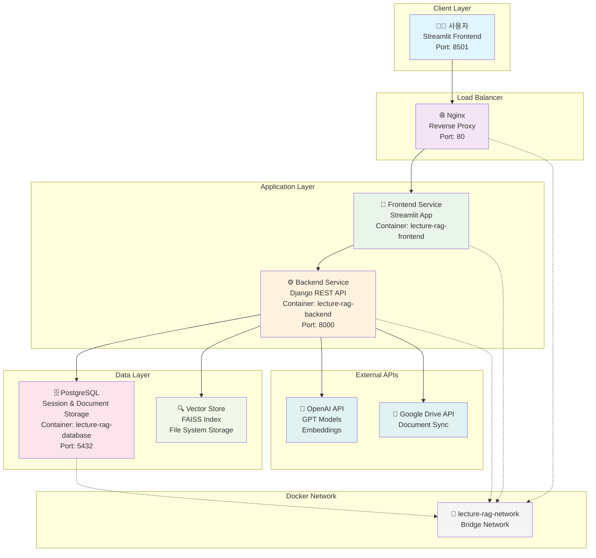
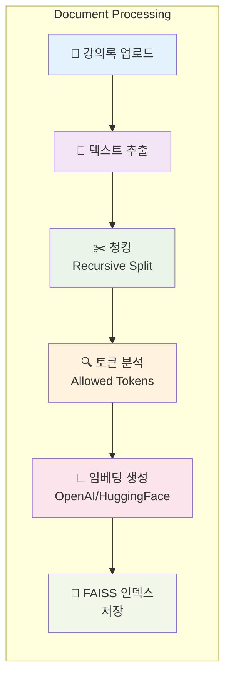
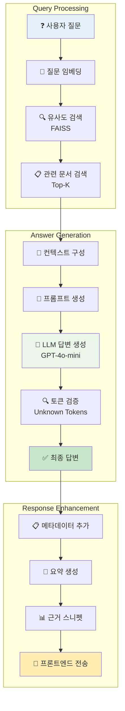

# 🎓 skn15-4th-1team

# 📋 목차
- [1. 팀 소개](#1-팀-소개)
- [2. 프로젝트 기간](#2-프로젝트-기간)
- [3. 프로젝트 개요](#3-프로젝트-개요)
  - [3.1 프로젝트명](#31--프로젝트명)
  - [3.2 프로젝트 배경 및 목적](#32--프로젝트-배경-및-목적)
  - [3.3 프로젝트 소개](#33--프로젝트-소개)
  - [3.4 기대효과](#34--기대효과)
  - [3.5 대상 사용자](#35--대상-사용자)
  - [3.6 프로젝트 폴더 구조](#36--프로젝트-폴더-구조)
  - [3.7 모듈 및 함수 별 기능](#37--모듈-및-함수-별-기능)
  - [3.8 시스템 아키텍처](#38--시스템-아키텍처)
  - [3.9 전체 파이프라인](#39--전체-파이프라인)
  - [3.10 단계별 입·출력](#310--단계별-입출력)
  - [3.11 프롬프트](#311--프롬프트)
  - [3.12 데이터 전처리](#312--데이터-전처리)
  - [3.13 환경설정](#313--환경설정)
- [4. 기술스택](#4-기술스택)
- [5. 수행결과](#5-수행결과)
  - [5.1 홈 화면 (Overview)](#51--홈-화면-overview)
  - [5.2 답변 섹션 (채팅 인터페이스)](#52--답변-섹션-채팅-인터페이스)
  - [5.3 근거 스니펫 (세부 확인 패널)](#53--근거-스니펫-세부-확인-패널)
  - [5.4 질의/옵션 입력 영역 (실행 패널)](#54--질의옵션-입력-영역-실행-패널)

# 1. 팀 소개

# 팀명 : 웅이와 아이들

<div align="center">


| **조태민** | **박진우** | **서혜선** | **임가은** | **임경원** | **홍민식** |
|:---:|:---:|:---:|:---:|:---:|:---:|
|  |  |  |  |  |  |
| [@o2mandoo](https://github.com/o2mandoo) | [@pjw876](https://github.com/pjw876) | [@hyeseon](https://github.com/hyeseon7135) | [@mars7421](https://github.com/mars7421) | [@KYUNGWON-99](https://github.com/KYUNGWON-99) | [@minnnsik](https://github.com/minnnsik) |

<div align="left">
  
# 2. 프로젝트 기간

**📅 전체 개발 기간**: 2024.09.15 ~ 2024.09.16 (2일)

# 3. 프로젝트 개요

## 3.1 📋 프로젝트명

**Lecture-RAG: 강의록 기반 RAG 챗봇 시스템**

> 대규모 강의 환경에서 교수와 학생 간의 효율적인 소통을 지원하는 AI 기반 질의응답 시스템

## 3.2 🎯 프로젝트 배경 및 목적

### 배경
- **대규모 강의 관리의 어려움**: 300명 이상의 학생들의 질문에 일일이 대응하기 어려움
- **반복 질문 처리 부담**: 동일한 질문의 반복으로 인한 교수 업무 과부하
- **시간 제약**: 오피스 아워 외 시간에는 질문 대응 불가
- **강의 개선 필요성**: 학생들의 질문 패턴 분석을 통한 강의 품질 향상 요구

### 목적
- **24/7 자동 질의응답 시스템 구축**: 시간 제약 없는 학습 지원
- **강의록 기반 정확한 답변 제공**: RAG 기술을 활용한 신뢰성 있는 정보 제공
- **질문 데이터 수집 및 분석**: 교수의 강의 개선을 위한 인사이트 제공
- **확장 가능한 클라우드 아키텍처**: AWS 기반 마이크로서비스 구조

## 3.3 🚀 프로젝트 소개

Lecture-RAG는 **Retrieval-Augmented Generation (RAG)** 기술을 활용하여 강의록을 기반으로 한 지능형 질의응답 시스템입니다. 3차 프로젝트에서 Streamlit 기반의 단일 애플리케이션으로 구현했던 시스템을 4차 프로젝트에서는 **마이크로서비스 아키텍처**로 확장하여 프론트엔드, 백엔드, 데이터베이스를 분리하고 AWS 클라우드 환경에서 운영할 수 있도록 발전시켰습니다.

### 🚀 주요 기능

| 기능 | 설명 | 기술 구현 |
|------|------|----------|
| **📚 강의록 자동 인덱싱** | 다양한 형식의 강의 문서를 벡터 데이터베이스에 자동 저장 | FAISS + OpenAI Embeddings |
| **🤖 지능형 질의응답** | 강의 내용 기반의 정확하고 맥락적인 답변 제공 | GPT-4o-mini + RAG Pipeline |
| **💬 채팅 인터페이스** | 직관적인 웹 기반 채팅 UI | Streamlit + Custom CSS |
| **📊 질문 데이터 수집** | 학생 질문 패턴 분석을 통한 강의 개선 인사이트 | PostgreSQL + Django ORM |
| **🔍 근거 스니펫 제공** | 답변의 출처가 되는 강의록 부분 명시 | Document Metadata + Chunking |
| **⚡ 실시간 응답** | 빠른 검색과 생성을 통한 즉시 답변 | Async Processing + Caching |
| **🌐 클라우드 배포** | AWS 기반 확장 가능한 마이크로서비스 | Docker + EC2 + Load Balancer |

### 🎯 3차 vs 4차 프로젝트 비교

| 구분 | 3차 프로젝트 | 4차 프로젝트 |
|------|-------------|-------------|
| **아키텍처** | 단일 Streamlit 애플리케이션 | 마이크로서비스 (Frontend/Backend/DB 분리) |
| **배포 환경** | 로컬 환경 | AWS 클라우드 환경 |
| **데이터베이스** | 파일 기반 저장 | PostgreSQL |
| **API** | 내부 함수 호출 | RESTful API |
| **확장성** | 단일 서버 | 다중 인스턴스 가능 |
| **모니터링** | 로컬 로그 | Docker 로그 + 헬스체크 |

## 3.4 🎁 기대효과

### 교수님 관점
- ⚡ **업무 효율성 향상**: 반복 질문 자동 처리로 연구 시간 40% 증가
- 📊 **데이터 기반 강의 개선**: 질문 패턴 분석으로 강의 취약점 파악
- 🕒 **24시간 학습 지원**: 시간 제약 없는 학생 질의응답 서비스
- 📈 **강의 품질 향상**: 실시간 학생 이해도 모니터링

### 학생 관점
- 🎯 **즉시 답변 획득**: 궁금한 점을 바로 해결하여 학습 효율성 증대
- 📖 **근거 기반 학습**: 답변 출처 제공으로 신뢰성 있는 정보 습득
- 💪 **자기주도 학습**: 시간과 장소에 구애받지 않는 학습 환경
- 🔍 **강의록 빠른 검색**: 방대한 강의 자료에서 필요한 정보 즉시 탐색

### 시스템 관점
- 📊 **질문 데이터 축적**: 교육 개선을 위한 빅데이터 구축
- 🚀 **확장 가능성**: 다른 과목 및 대학으로 시스템 확장 가능
- 💰 **비용 효율성**: 자동화를 통한 교육 운영 비용 절감
- 🔧 **지속적 개선**: AI 모델 업데이트를 통한 답변 품질 향상

## 3.5 👥 대상 사용자

### 🧑‍🏫 주 사용자: 데이터 사이언스 학과 교수


**김교수님 (45세, 데이터 사이언스과 교수)**

**현재 상황:**
- 매 학기 300명 이상의 대규모 강의 진행
- 주당 평균 50-80개의 반복적인 질문 대응
- 강의 개선을 위한 학생 피드백 분석에 시간 부족
- 온라인/오프라인 혼합 수업 환경에서의 질의응답 관리 어려움

**기대 효과:**
- ⚡ **즉시 대응**: 학생 질문에 24시간 자동 답변
- 📊 **데이터 기반 개선**: 질문 패턴 분석으로 강의 취약점 파악
- ⏰ **시간 절약**: 반복 질문 자동 처리로 연구 시간 확보
- 📈 **강의 품질 향상**: 학생 이해도 실시간 모니터링

### 👨‍🎓 부 사용자: 학생


**이학생 (22세, 데이터 사이언스과 3학년)**

**현재 상황:**
- 강의 내용 복습 중 궁금한 점 발생
- 교수님께 직접 질문하기 부담스러움
- 오피스 아워 시간 제약
- 과제 수행 중 강의록 내용 검색의 어려움

**기대 효과:**
- 🕒 **언제든 질문**: 시간 제약 없이 강의 관련 질문
- 🎯 **정확한 답변**: 강의록 기반의 신뢰할 수 있는 정보
- 📝 **학습 지원**: 복습 및 과제 수행 시 즉시 도움
- 📖 **근거 제공**: 답변의 출처가 되는 강의록 페이지 명시

## 3.6 📁 프로젝트 폴더 구조

```
skn15-4th-1team/
├── 🐳 docker-compose.yml          # 전체 서비스 오케스트레이션
├── 🚀 deploy.sh                   # AWS 배포 자동화 스크립트
├── 🌐 nginx.conf                  # Nginx 리버스 프록시 설정
│
├── 📱 frontend/                   # Streamlit 프론트엔드
│   ├── app.py                     # 메인 Streamlit 애플리케이션
│   ├── api_client.py              # Backend API 클라이언트
│   ├── requirements.txt           # 프론트엔드 의존성
│   └── 🐳 Dockerfile.frontend    # 프론트엔드 컨테이너 이미지
│
├── ⚙️ backend/                   # Django REST API 백엔드
│   ├── backend/                   # Django 프로젝트 설정
│   │   ├── settings.py            # Django 설정 (DB, CORS, RAG)
│   │   ├── urls.py                # URL 라우팅
│   │   └── wsgi.py                # WSGI 애플리케이션
│   ├── rag_api/                   # RAG API 앱
│   │   ├── models.py              # 데이터 모델 (Document, ChatSession, ChatMessage)
│   │   ├── views.py               # API 뷰 (인덱싱, 채팅, 검색)
│   │   ├── serializers.py         # API 시리얼라이저
│   │   ├── urls.py                # API 엔드포인트
│   │   └── apps.py                # 앱 설정
│   ├── manage.py                  # Django 관리 도구
│   ├── requirements.txt           # 백엔드 의존성
│   └── 🐳 Dockerfile.backend     # 백엔드 컨테이너 이미지
│
├── 🗄️ database/                  # PostgreSQL 데이터베이스
│   ├── init.sql                   # 데이터베이스 초기화 스크립트
│   └── 🐳 Dockerfile.database    # 데이터베이스 컨테이너 이미지
│
├── 🤖 lecture_rag/               # 핵심 RAG 엔진
│   ├── config.py                  # RAG 설정 관리
│   ├── vector_store.py            # FAISS 벡터 스토어 관리
│   ├── document_processor.py      # 문서 처리 및 청킹
│   ├── llm_handler.py             # LLM 모델 관리
│   ├── utils.py                   # 유틸리티 함수
│   ├── langgraph_flow.py          # RAG 플로우 시각화
│   ├── google_drive.py            # Google Drive 연동
│   ├── main.py                    # RAG 엔진 진입점
│   └── app.py                     # 독립 실행용 Streamlit 앱
│
├── 🐳 Dockerfile.nginx           # Nginx 컨테이너 이미지
├── 📋 requirements.txt           # 전체 프로젝트 의존성
└── 📖 README.md                  # 프로젝트 문서
```

## 3.7 🔧 모듈 및 함수 별 기능

### Frontend Layer (Streamlit)

| 파일 | 클래스/함수 | 기능 설명 |
|------|-------------|----------|
| **app.py** | `LectureRAGApp` | 메인 애플리케이션 클래스 |
| | `_setup_page()` | 페이지 설정 및 CSS 스타일링 |
| | `_render_chat_interface()` | 채팅 인터페이스 렌더링 |
| | `_handle_chat_qa()` | 질의응답 처리 로직 |
| | `_render_detailed_view()` | 상세 답변 및 근거 스니펫 표시 |
| **api_client.py** | `APIClient` | Backend API 통신 클라이언트 |
| | `chat()` | 채팅 API 호출 |
| | `index_document()` | 문서 인덱싱 API 호출 |
| | `health_check()` | 헬스체크 API 호출 |

### Backend Layer (Django)

| 파일 | 클래스/함수 | 기능 설명 |
|------|-------------|----------|
| **models.py** | `Document` | 문서 메타데이터 모델 |
| | `ChatSession` | 채팅 세션 모델 |
| | `ChatMessage` | 채팅 메시지 모델 |
| **views.py** | `IndexDocumentView` | 문서 인덱싱 API 뷰 |
| | `ChatView` | 질의응답 API 뷰 |
| | `SearchView` | 문서 검색 API 뷰 |
| | `HealthCheckView` | 시스템 상태 확인 API |
| **serializers.py** | `ChatRequestSerializer` | 채팅 요청 데이터 검증 |
| | `IndexDocumentRequestSerializer` | 인덱싱 요청 데이터 검증 |

### RAG Engine Layer

| 파일 | 클래스/함수 | 기능 설명 |
|------|-------------|----------|
| **vector_store.py** | `VectorStore` | FAISS 벡터 스토어 관리 |
| | `index_document()` | 문서 임베딩 및 인덱싱 |
| | `search()` | 유사도 검색 수행 |
| **document_processor.py** | `DocumentProcessor` | 문서 처리 및 청킹 |
| | `chunk_documents()` | 문서를 청크 단위로 분할 |
| **llm_handler.py** | `LLMHandler` | LLM 모델 관리 |
| | `generate_answer()` | AI 답변 생성 |
| | `_check_unknown_tokens()` | 미허용 토큰 검사 |
| **utils.py** | `extract_allowed_tokens()` | 허용 토큰 추출 |
| | `read_text()` | 텍스트 파일 읽기 |

### Infrastructure Layer

| 파일 | 기능 설명 |
|------|----------|
| **docker-compose.yml** | 전체 서비스 오케스트레이션 |
| **nginx.conf** | 리버스 프록시 설정 |
| **deploy.sh** | AWS 배포 자동화 스크립트 |
| **Dockerfile.*** | 각 서비스별 컨테이너 이미지 정의 |

## 3.8 🏗️ 시스템 아키텍처



### 🔄 통신 흐름

| 단계 | 구성요소 | 포트 | 역할 |
|------|----------|------|------|
| 1 | **Nginx** | 80 | HTTP 요청 라우팅 및 로드 밸런싱 |
| 2 | **Frontend** | 8501 | 사용자 인터페이스 및 상태 관리 |
| 3 | **Backend** | 8000 | 비즈니스 로직 및 RAG 처리 |
| 4 | **Database** | 5432 | 세션, 채팅 기록, 문서 메타데이터 저장 |
| 5 | **Vector Store** | - | 문서 임베딩 및 유사도 검색 |

## 3.9 🔄 전체 파이프라인

### 1. 문서 처리 파이프라인



### 2. 질의응답 파이프라인



### 3. RAG 구성 요소 상세

| 단계 | 기술 | 설정 | 역할 |
|------|------|------|------|
| **문서 청킹** | Recursive Character Text Splitter | chunk_size=1000, overlap=200 | 문서를 의미 단위로 분할 |
| **임베딩** | OpenAI text-embedding-3-small | 1536 dimensions | 텍스트를 벡터로 변환 |
| **벡터 검색** | FAISS (CPU) | Cosine similarity | 유사한 문서 청크 검색 |
| **답변 생성** | GPT-4o-mini | temperature=0.2 | 컨텍스트 기반 답변 생성 |
| **토큰 검증** | Custom Filter | allowed_tokens.json | 허용되지 않은 토큰 필터링 |

## 3.10 📊 단계별 입·출력

### 문서 인덱싱 단계

| 단계 | 입력 | 처리 | 출력 |
|------|------|------|------|
| **1. 파일 업로드** | 강의록 텍스트 파일 | Streamlit 파일 업로더 | 파일 바이너리 데이터 |
| **2. 텍스트 추출** | 파일 바이너리 | UTF-8 디코딩 | 순수 텍스트 문자열 |
| **3. 문서 청킹** | 텍스트 문자열 | RecursiveCharacterTextSplitter | Document 객체 리스트 |
| **4. 임베딩 생성** | Document 객체들 | OpenAI Embeddings API | 1536차원 벡터 배열 |
| **5. 벡터 인덱싱** | 벡터 배열 | FAISS 인덱스 생성 | .faiss, .pkl 파일 |
| **6. 메타데이터 저장** | 문서 정보 | PostgreSQL 저장 | Document 레코드 |

### 질의응답 단계

| 단계 | 입력 | 처리 | 출력 |
|------|------|------|------|
| **1. 질문 접수** | 사용자 질문 텍스트 | Streamlit 입력창 | 질문 문자열 |
| **2. 질문 임베딩** | 질문 문자열 | OpenAI Embeddings API | 1536차원 질문 벡터 |
| **3. 유사도 검색** | 질문 벡터 | FAISS 코사인 유사도 | Top-K 문서 청크들 |
| **4. 컨텍스트 구성** | 검색된 문서들 | 텍스트 결합 및 포맷팅 | 구조화된 컨텍스트 |
| **5. 프롬프트 생성** | 질문 + 컨텍스트 | 템플릿 기반 생성 | 완성된 프롬프트 |
| **6. AI 답변 생성** | 프롬프트 | GPT-4o-mini API | AI 생성 답변 |
| **7. 토큰 검증** | AI 답변 | 허용 토큰 필터링 | 검증된 최종 답변 |
| **8. 응답 포맷팅** | 최종 답변 + 메타데이터 | JSON 직렬화 | API 응답 객체 |

## 3.11 📝 프롬프트

### System Prompt
```
당신은 강의록을 기반으로 학생들의 질문에 답변하는 AI 어시스턴트입니다.
다음 지침을 따라 답변해주세요:

1. 제공된 강의록 내용만을 기반으로 답변하세요
2. 강의록에 없는 내용은 "강의록에서 다루지 않은 주제입니다"라고 명시하세요
3. 코드 예시가 있다면 정확히 인용하세요
4. 답변은 한국어로 작성하세요
5. 학생이 이해하기 쉽도록 친근하고 명확하게 설명하세요
```

### Answer Prompt
```
강의록 컨텍스트:
{context}

학생 질문: {question}

위 강의록 내용을 바탕으로 학생의 질문에 답변해주세요.
강의록에 관련 내용이 없다면 "강의록에서 다루지 않은 주제입니다"라고 명시하세요.
```

### 프롬프트 의도
- **제한된 답변 범위**: 강의록 내용만으로 답변을 제한하여 정확성 보장
- **명확한 출처 표시**: 강의록에 없는 내용은 명시적으로 거부
- **교육적 톤**: 학생에게 친근하고 이해하기 쉬운 설명 제공
- **일관된 형식**: 모든 답변이 일정한 품질과 형식을 유지

## 3.12 🔄 데이터 전처리

### 문서 전처리 과정

```python
# 1. 텍스트 정규화
def normalize_text(text: str) -> str:
    # 공백 문자 정규화
    text = re.sub(r'\s+', ' ', text)
    # 특수 문자 정리
    text = re.sub(r'[^\w\s가-힣]', ' ', text)
    return text.strip()

# 2. 청킹 전략
def chunk_documents(text: str) -> List[Document]:
    splitter = RecursiveCharacterTextSplitter(
        chunk_size=1000,           # 청크 크기
        chunk_overlap=200,         # 중복 크기
        length_function=len,       # 길이 계산 함수
        separators=["\n\n", "\n", " ", ""]  # 분할 우선순위
    )
    return splitter.create_documents([text])

# 3. 메타데이터 추가
def add_metadata(chunks: List[Document], source: str) -> List[Document]:
    for i, chunk in enumerate(chunks):
        chunk.metadata.update({
            "source": source,
            "chunk_id": i,
            "chunk_size": len(chunk.page_content)
        })
    return chunks
```

### 허용 토큰 추출

```python
def extract_allowed_tokens(text: str) -> Dict[str, List[str]]:
    """
    강의록에서 사용된 모듈과 심볼을 추출하여 허용 토큰 생성
    """
    # Python 코드 블록 추출
    code_blocks = re.findall(r'```python\n(.*?)\n```', text, re.DOTALL)

    modules = set()
    symbols = set()

    for code in code_blocks:
        # import 문에서 모듈 추출
        imports = re.findall(r'import (\w+)', code)
        modules.update(imports)

        # 변수명과 함수명 추출
        symbols.update(re.findall(r'\b([a-zA-Z_]\w*)\b', code))

    return {
        "modules": list(modules),
        "symbols": list(symbols)
    }
```

## 3.13 ⚙️ 환경설정

### 개발 환경 설정

```bash
# 1. 저장소 클론
git clone <repository-url>
cd skn15-4th-1team

# 2. 환경 변수 파일 생성
cp .env.example .env

# 3. OpenAI API 키 설정
echo "OPENAI_API_KEY=your_api_key_here" >> .env

# 4. Docker 환경 구성
docker-compose up -d --build
```

### 운영 환경 설정

```bash
# AWS EC2 인스턴스에서
# 1. Docker 설치
sudo yum update -y
sudo yum install -y docker
sudo service docker start

# 2. 프로젝트 배포
./deploy.sh
# 배포 옵션 선택 (1-6)
```

### 환경 변수 상세

| 변수명 | 기본값 | 설명 |
|--------|--------|------|
| `OPENAI_API_KEY` | 필수 입력 | OpenAI API 인증 키 |
| `POSTGRES_DB` | lecture_rag | 데이터베이스 이름 |
| `POSTGRES_USER` | lecture_user | DB 사용자명 |
| `POSTGRES_PASSWORD` | 사용자 설정 | DB 비밀번호 |
| `LECTURE_RAG_MODEL` | gpt-4o-mini | 사용할 LLM 모델 |
| `LECTURE_RAG_TEMPERATURE` | 0.2 | LLM 창의성 수준 |
| `VECTOR_STORE_DIR` | /app/data/vector_store | 벡터 스토어 저장 경로 |

# 4. 기술스택

| 분야 (Category) | 기술 스택 (Technology) | 세부 내용 (Details) |
| :--- | :--- | :--- |
| **Backend** |  <br/>  | Django 4.2+ 버전 및 DRF를 사용한 RESTful API 서버 구성 |
| |  | 채팅 세션, 메시지, 문서 메타데이터 저장용 관계형 데이터베이스 |
| |  | Production 환경용 WSGI 웹 서버 |
| **Frontend** |  <br/>  | 채팅 UI 및 Backend API 통신 클라이언트 |
| |  | 카카오톡 스타일 채팅 UI 커스텀 스타일링 |
| **AI/ML** |  | GPT-4o-mini 언어모델 및 text-embedding-3-small 임베딩 |
| |  | CPU 기반 벡터 유사도 검색 라이브러리 |
| |  | 문서 처리, 청킹, RAG 파이프라인 구성 |
| **Infrastructure** |  <br/>  | 마이크로서비스 컨테이너화 및 오케스트레이션 |
| |  | 리버스 프록시 및 로드 밸런서 |
| |  | 클라우드 컴퓨팅 인스턴스 기반 배포 |

# 5. 수행결과

## 5.1 🏠 홈 화면 (Overview)


### 메인 인터페이스
- **직관적인 채팅 UI**: 카카오톡과 유사한 친숙한 인터페이스
- **사이드바 설정 패널**: LLM 모델, Temperature, Top-K 설정
- **실시간 API 상태 표시**: Backend 연결 상태 확인
- **파일 업로드 기능**: 강의록 드래그 앤 드롭 업로드


## 5.2 💬 답변 섹션 (채팅 인터페이스)


### 질의응답 플로우

| 단계 | 사용자 화면 | 시스템 처리 |
|------|-------------|-------------|
| **1. 질문 입력** | "리스트를 정렬하는 방법은?" | 텍스트 임베딩 생성 |
| **2. 로딩 표시** | "AI웅이 답변을 생성하고 있어요..." | 벡터 검색 + LLM 호출 |
| **3. 요약 답변** | 클릭 가능한 요약 카드 | 2-3문장 요약 생성 |
| **4. 상세 보기** | 전체 답변 + 근거 스니펫 | 메타데이터 포함 응답 |


## 5.3 🔍 근거 스니펫 (세부 확인 패널)


### 근거 제공 방식
- **출처 명시**: 라인 번호, 청크 종류, 시작 라인 미리보기
- **원본 추적**: 강의록에서 해당 부분을 찾을 수 있는 검색 힌트
- **코드 하이라이팅**: Python 코드는 syntax highlighting 적용
- **확장/축소**: 펼치기/접기 가능한 아코디언 UI


## 5.4 ⚙️ 질의/옵션 입력 영역 (실행 패널)


### 설정 옵션

| 옵션 | 기본값 | 범위 | 설명 |
|------|--------|------|------|
| **LLM 모델** | gpt-4o-mini | 8개 모델 | OpenAI, Claude, Gemini 지원 |
| **Temperature** | 0.2 | 0.0 - 1.0 | 답변 창의성 수준 |
| **Top-K** | 5 | 1 - 10 | 검색할 문서 청크 수 |


### 인덱싱 기능
```
📤 인덱싱
┌─────────────────────────────────────┐
│ 📁 강의록 파일 업로드                │
│ (.txt, .md, .py, .mdx)              │
└─────────────────────────────────────┘
[📊 인덱싱 실행] [⚙️ 설정]

✅ 인덱싱 완료! 문서 조각 15개 생성
📋 허용 토큰(모듈/심볼) 보기 ▼
```


# 6. 한 줄 회고

|**조태민**|**박진우**|**서혜선**|
|----|---|---|
| 로컬 환경에서 개발한 RAG 시스템을 AWS 클라우드 기반 마이크로서비스 아키텍처로 확장하며, Docker 컨테이너 배포 및 Nginx 로드 밸런싱까지 실제 운영 환경을 경험할 수 있었던 소중한 시간이었습니다| AWS EC2에 Docker 컨테이너로 배포하면서 로컬 실행과 실제 서버 환경의 차이를 크게 느꼈습니다. 보안 그룹과 포트 설정, 환경 변수 관리에서 시행착오를 겪었지만 문제를 직접 해결하며 배포 과정에 대한 이해가 깊어졌습니다. 무엇보다 코드 작성뿐 아니라 실제 운영까지 고려해야 한다는 점을 배우게 된 소중한 경험이었습니다. | AWS EC2 서버에서 Docker 컨테이너로 배포된 환경을 관찰하며 로컬 환경과 서버 환경의 차이를 생생하게 체감할 수 있었습니다. 단순히 코드를 작성하는 것뿐 아니라, 실제 서비스를 안정적으로 운영하기 위해 전체 시스템과 환경 설정을 고려해야 한다는 점을 배웠습니다. 이번 경험을 통해 개발뿐 아니라 DevOps 관점까지 시야를 넓히는 소중한 기회가 되었습니다. |


|**임가은**|**임경원**|**홍민식**|
|----|---|---|
| 이번 프로젝트를 통해 AWS와 Docker를 직접 다루며 클라우드 환경에서 컨테이너를 운영하는 경험을 쌓을 수 있었습니다. 각 서비스별 컨테이너를 분리하고 네트워크를 구성하면서 시스템 간 통신과 배포 과정의 중요성을 깊이 이해하게 되었습니다. 처음에는 설정과 연결 과정이 복잡하게 느껴졌지만, 직접 구현하면서 문제 해결 능력과 실무 감각이 많이 향상된 것을 느꼈습니다. 이번 경험을 통해 클라우드 기반 마이크로서비스 운영에 대한 자신감이 생겼습니다. | 서버에 서비스를 올리는 과정은 생각보다 복잡했습니다. 작은 설정 하나가 예상치 못한 문제를 만들기도 했고, 로컬에서 잘 되던 기능이 AWS 환경의 Docker 컨테이너에서는 제대로 작동하지 않기도 했습니다. 하지만 하나씩 문제를 해결하며 배포 과정 자체가 배움이 된다는 걸 깨달았고, 덕분에 클라우드 환경에서 컨테이너를 운영하는 경험을 쌓을 수 있었습니다. |RAG 파이프라인의 각 구성 요소(청킹, 임베딩, 검색, LLM 답변 생성, 토큰 검증)를 깊이 이해하고 직접 구현하면서, 강의록 기반 질의응답 시스템의 정확성과 효율성을 높이는 방법을 체득할 수 있었습니다. |


**🎓 Lecture-RAG로 더 나은 교육 환경을 만들어보세요!**
