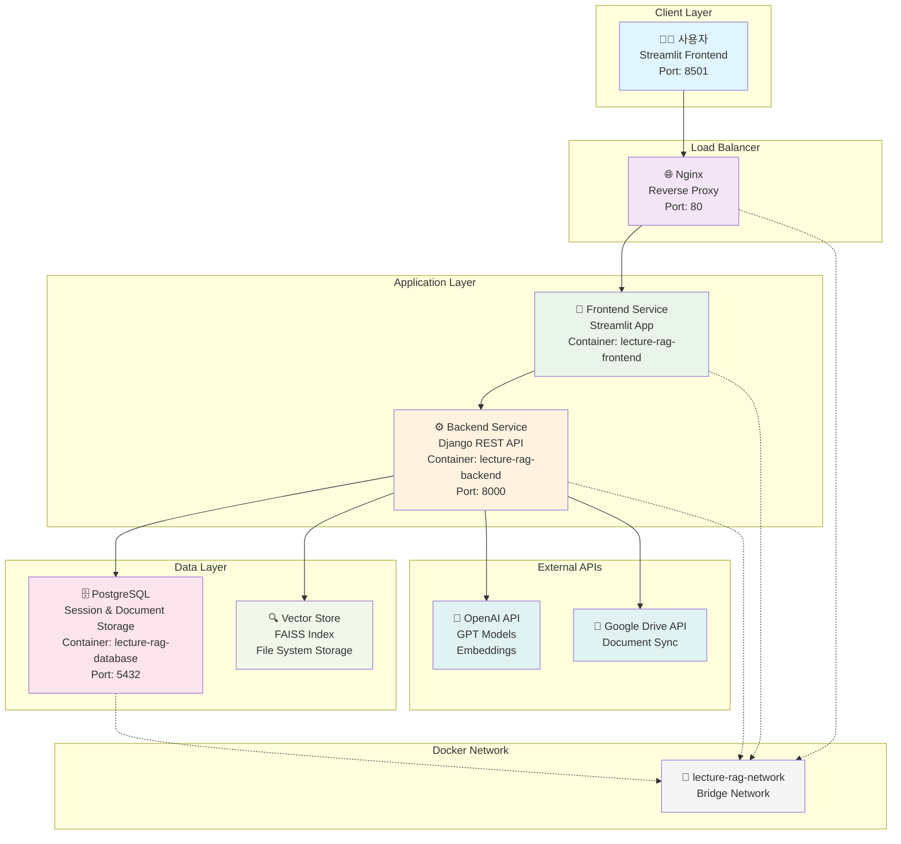
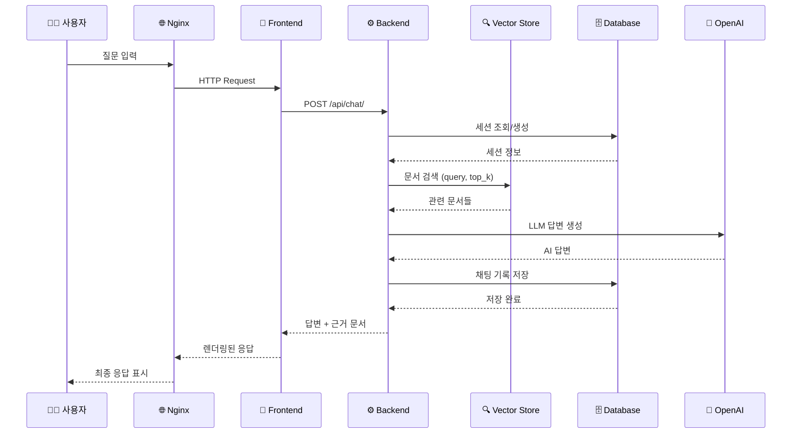
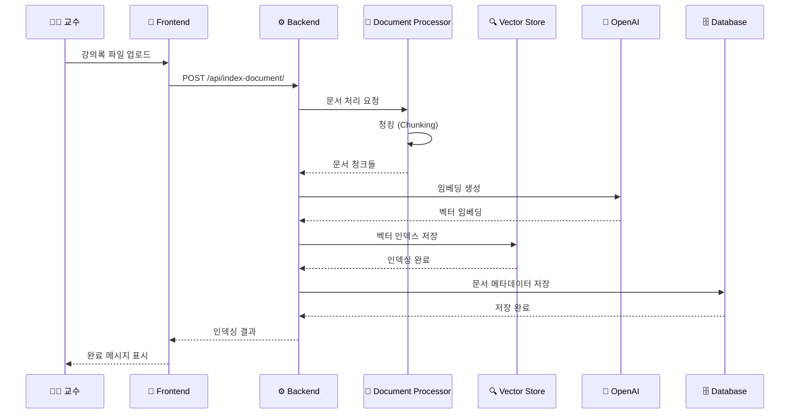
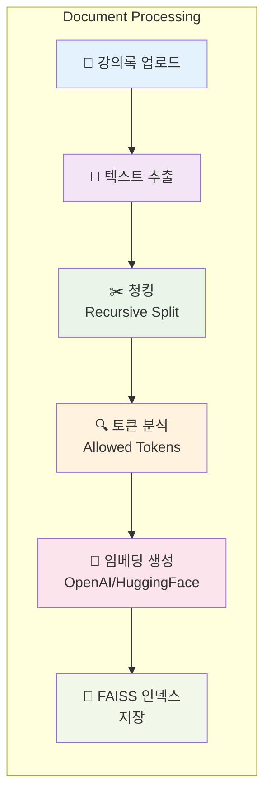
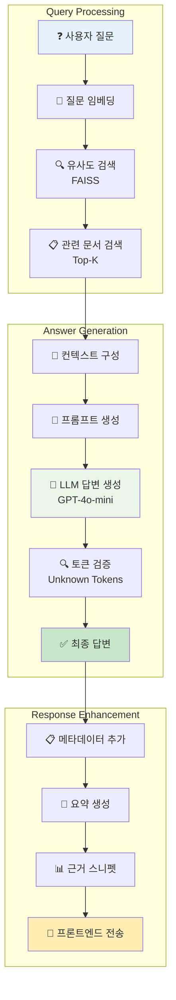
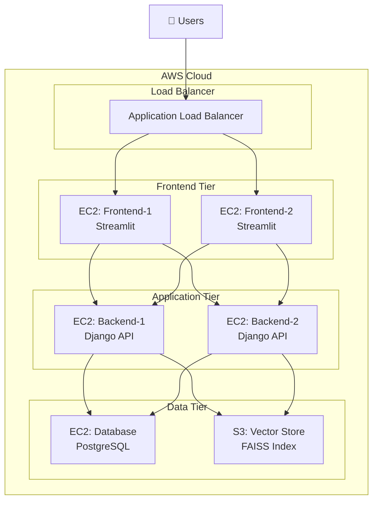

# 🎓 Lecture-RAG: 강의록 기반 RAG 챗봇 시스템

> 대규모 강의 환경에서 교수와 학생 간의 효율적인 소통을 지원하는 AI 기반 질의응답 시스템

## 📋 목차

- [프로젝트 개요](#-프로젝트-개요)
- [대상 사용자 페르소나](#-대상-사용자-페르소나)
- [시스템 아키텍처](#-시스템-아키텍처)
- [기술 스택](#-기술-스택)
- [디렉토리 구조](#-디렉토리-구조)
- [설치 및 실행](#-설치-및-실행)
- [API 문서](#-api-문서)
- [통신 플로우](#-통신-플로우)
- [RAG 파이프라인](#-rag-파이프라인)
- [모니터링 및 로깅](#-모니터링-및-로깅)
- [배포 가이드](#-배포-가이드)
- [트러블슈팅](#-트러블슈팅)

# 1. 팀 소개 
# 팀명 : 웅이와 아이들


| **조태민** | **박진우** | **서혜선** | **임가은** | **임경원** | **홍민식** |
|:---:|:---:|:---:|:---:|:---:|:---:|
|  |  |  |  |  |  |
| [@o2mandoo](https://github.com/o2mandoo) | [@pjw876](https://github.com/pjw876) | [@hyeseon](https://github.com/hyeseon7135) | [@mars7421](https://github.com/mars7421) | [@KYUNGWON-99](https://github.com/KYUNGWON-99) | [@minnnsik](https://github.com/minnnsik) |


## 🎯 프로젝트 개요

Lecture-RAG는 **Retrieval-Augmented Generation (RAG)** 기술을 활용한 강의록 기반 질의응답 시스템입니다.

### 🚀 주요 기능

- **📚 강의록 자동 인덱싱**: 다양한 형식의 강의 문서를 벡터 데이터베이스에 자동 저장
- **🤖 지능형 질의응답**: 강의 내용 기반의 정확하고 맥락적인 답변 제공
- **💬 채팅 인터페이스**: 직관적인 Streamlit 기반 웹 채팅 UI
- **📊 질문 데이터 수집**: 학생 질문 패턴 분석을 통한 강의 개선 인사이트
- **🔍 근거 스니펫 제공**: 답변의 출처가 되는 강의록 부분 명시
- **⚡ 실시간 응답**: 빠른 검색과 생성을 통한 즉시 답변

### 🎯 해결하는 문제

1. **대규모 강의 관리**: 수백 명의 학생 질문에 일일이 대응하기 어려운 문제
2. **반복 질문 처리**: 동일한 질문의 반복으로 인한 교수 업무 부담
3. **강의 개선**: 학생들의 질문 패턴 분석을 통한 강의 품질 향상
4. **24/7 지원**: 시간 제약 없는 학습 지원 서비스

## 👥 대상 사용자 페르소나

### 🧑‍🏫 주 사용자: 데이터 사이언스 학과 교수

**김교수님 (45세, 데이터 사이언스과 교수)**

**현재 상황:**
- 매 학기 300명 이상의 대규모 강의 진행
- 주당 평균 50-80개의 반복적인 질문 대응
- 강의 개선을 위한 학생 피드백 분석에 시간 부족
- 온라인/오프라인 혼합 수업 환경에서의 질의응답 관리 어려움

**기대 효과:**
- ⚡ **즉시 대응**: 학생 질문에 24시간 자동 답변
- 📊 **데이터 기반 개선**: 질문 패턴 분석으로 강의 취약점 파악
- ⏰ **시간 절약**: 반복 질문 자동 처리로 연구 시간 확보
- 📈 **강의 품질 향상**: 학생 이해도 실시간 모니터링

### 👨‍🎓 부 사용자: 학생

**이학생 (22세, 데이터 사이언스과 3학년)**

**현재 상황:**
- 강의 내용 복습 중 궁금한 점 발생
- 교수님께 직접 질문하기 부담스러움
- 오피스 아워 시간 제약
- 과제 수행 중 강의록 내용 검색의 어려움

**기대 효과:**
- 🕒 **언제든 질문**: 시간 제약 없이 강의 관련 질문
- 🎯 **정확한 답변**: 강의록 기반의 신뢰할 수 있는 정보
- 📝 **학습 지원**: 복습 및 과제 수행 시 즉시 도움
- 📖 **근거 제공**: 답변의 출처가 되는 강의록 페이지 명시

## 🏗️ 시스템 아키텍처



### 🔄 통신 흐름

| 단계 | 구성요소 | 포트 | 역할 |
|------|----------|------|------|
| 1 | **Nginx** | 80 | HTTP 요청 라우팅 및 로드 밸런싱 |
| 2 | **Frontend** | 8501 | 사용자 인터페이스 및 상태 관리 |
| 3 | **Backend** | 8000 | 비즈니스 로직 및 RAG 처리 |
| 4 | **Database** | 5432 | 세션, 채팅 기록, 문서 메타데이터 저장 |
| 5 | **Vector Store** | - | 문서 임베딩 및 유사도 검색 |

## 🛠️ 기술 스택

### Backend (Django)
```yaml
Framework: Django 4.2+ with Django REST Framework
Database: PostgreSQL 13+
Vector Store: FAISS (Facebook AI Similarity Search)
Embeddings: OpenAI text-embedding-3-small / HuggingFace Transformers
LLM: OpenAI GPT-4o-mini, GPT-3.5-turbo
WSGI Server: Gunicorn
```

### Frontend (Streamlit)
```yaml
Framework: Streamlit 1.28+
HTTP Client: Requests
State Management: Streamlit Session State
UI Components: Custom CSS + Streamlit Widgets
```

### Infrastructure
```yaml
Containerization: Docker & Docker Compose
Reverse Proxy: Nginx
Database: PostgreSQL
Networking: Docker Bridge Network
Storage: Named Volumes for persistence
```

### AI/ML Stack
```yaml
Embeddings: OpenAI text-embedding-3-small
LLM: OpenAI GPT Series
Vector Search: FAISS CPU
Document Processing: LangChain
Chunking Strategy: Recursive Character Text Splitter
```

## 📁 디렉토리 구조

```
skn15-4th-1team/
├── 🐳 docker-compose.yml          # 전체 서비스 오케스트레이션
├── 🚀 deploy.sh                   # AWS 배포 자동화 스크립트
├── 🌐 nginx.conf                  # Nginx 리버스 프록시 설정
│
├── 📱 frontend/                   # Streamlit 프론트엔드
│   ├── app.py                     # 메인 Streamlit 애플리케이션
│   ├── api_client.py              # Backend API 클라이언트
│   ├── requirements.txt           # 프론트엔드 의존성
│   └── 🐳 Dockerfile.frontend    # 프론트엔드 컨테이너 이미지
│
├── ⚙️ backend/                   # Django REST API 백엔드
│   ├── backend/                   # Django 프로젝트 설정
│   │   ├── settings.py            # Django 설정 (DB, CORS, RAG)
│   │   ├── urls.py                # URL 라우팅
│   │   └── wsgi.py                # WSGI 애플리케이션
│   ├── rag_api/                   # RAG API 앱
│   │   ├── models.py              # 데이터 모델 (Document, ChatSession, ChatMessage)
│   │   ├── views.py               # API 뷰 (인덱싱, 채팅, 검색)
│   │   ├── serializers.py         # API 시리얼라이저
│   │   ├── urls.py                # API 엔드포인트
│   │   └── apps.py                # 앱 설정
│   ├── manage.py                  # Django 관리 도구
│   ├── requirements.txt           # 백엔드 의존성
│   └── 🐳 Dockerfile.backend     # 백엔드 컨테이너 이미지
│
├── 🗄️ database/                  # PostgreSQL 데이터베이스
│   ├── init.sql                   # 데이터베이스 초기화 스크립트
│   └── 🐳 Dockerfile.database    # 데이터베이스 컨테이너 이미지
│
├── 🤖 lecture_rag/               # 핵심 RAG 엔진
│   ├── config.py                  # RAG 설정 관리
│   ├── vector_store.py            # FAISS 벡터 스토어 관리
│   ├── document_processor.py      # 문서 처리 및 청킹
│   ├── llm_handler.py             # LLM 모델 관리
│   ├── utils.py                   # 유틸리티 함수
│   ├── langgraph_flow.py          # RAG 플로우 시각화
│   ├── google_drive.py            # Google Drive 연동
│   ├── main.py                    # RAG 엔진 진입점
│   └── app.py                     # 독립 실행용 Streamlit 앱
│
├── 🐳 Dockerfile.nginx           # Nginx 컨테이너 이미지
├── 📋 requirements.txt           # 전체 프로젝트 의존성
└── 📖 README.md                  # 프로젝트 문서
```

### 주요 모듈별 역할

| 모듈 | 책임 | 핵심 기능 |
|------|------|-----------|
| **frontend/** | 사용자 인터페이스 | 채팅 UI, 파일 업로드, 설정 관리 |
| **backend/rag_api/** | REST API 서버 | 인덱싱, 검색, 채팅 API 제공 |
| **lecture_rag/** | RAG 엔진 | 문서 처리, 벡터 검색, LLM 답변 생성 |
| **database/** | 데이터 저장소 | 채팅 기록, 세션, 문서 메타데이터 |

## 🚀 설치 및 실행

### 전제 조건

- Docker 20.10+
- Docker Compose 2.0+
- OpenAI API Key (필수)

### 1. 환경 설정

```bash
# 프로젝트 클론
git clone <repository-url>
cd skn15-4th-1team

# 환경 변수 설정
cp .env.example .env
```

### 2. 환경 변수 구성 (.env)

```env
# Database Settings
POSTGRES_DB=lecture_rag
POSTGRES_USER=lecture_user
POSTGRES_PASSWORD=your_secure_password
DB_HOST=database
DB_PORT=5432

# API Keys
OPENAI_API_KEY=your_openai_api_key_here

# RAG Settings
LECTURE_RAG_MODEL=gpt-4o-mini
LECTURE_RAG_TEMPERATURE=0.2
LECTURE_RAG_DEFAULT_TOP_K=5
LECTURE_RAG_MAX_TOP_K=10
LECTURE_RAG_MIN_TOP_K=1

# Service Ports
FRONTEND_PORT=8501
BACKEND_PORT=8000
DATABASE_PORT=5432

# Storage
VECTOR_STORE_DIR=/app/data/vector_store

# Security
SECRET_KEY=your-secret-key-here
DEBUG=False
ALLOWED_HOSTS=localhost,127.0.0.1
```

### 3. 전체 시스템 실행

```bash
# 모든 서비스 빌드 및 실행
docker-compose up -d --build

# 로그 확인
docker-compose logs -f

# 서비스 상태 확인
docker-compose ps
```

### 4. 개별 서비스 실행 (AWS 배포용)

```bash
# 배포 스크립트 사용
chmod +x deploy.sh
./deploy.sh

# 배포 옵션 선택:
# 1) Frontend (Streamlit)
# 2) Backend (Django)
# 3) Database (PostgreSQL)
# 4) Nginx (Reverse Proxy)
# 5) Frontend + Nginx
# 6) 전체 (docker-compose)
```

### 5. 접속 확인

| 서비스 | URL | 설명 |
|--------|-----|------|
| **메인 애플리케이션** | http://localhost | Nginx를 통한 접속 |
| **Streamlit 직접** | http://localhost:8501 | 프론트엔드 직접 접속 |
| **API 서버** | http://localhost:8000 | Backend REST API |
| **API 헬스체크** | http://localhost:8000/api/health/ | 서버 상태 확인 |

## 📡 API 문서

### Base URL
```
http://localhost:8000/api/
```

### 인증
현재 버전은 인증이 없는 오픈 API입니다.

### 엔드포인트

#### 1. 헬스 체크
```http
GET /api/health/
```

**응답:**
```json
{
    "status": "healthy",
    "timestamp": "2024-01-15T10:30:00Z",
    "version": "1.0.0",
    "database": "connected",
    "openai_key": "configured"
}
```

#### 2. 문서 인덱싱
```http
POST /api/index-document/
```

**요청:**
```json
{
    "filename": "lecture_01.txt",
    "file_content": "강의 내용...",
    "model_name": "gpt-4o-mini",
    "temperature": 0.2
}
```

**응답:**
```json
{
    "document_id": 1,
    "n_documents": 15,
    "allowed_tokens": {
        "modules": ["numpy", "pandas"],
        "symbols": ["list", "dict"]
    },
    "message": "Successfully indexed 15 document chunks"
}
```

#### 3. 채팅 (질의응답)
```http
POST /api/chat/
```

**요청:**
```json
{
    "session_id": "user-123",
    "query": "리스트를 정렬하는 방법은?",
    "top_k": 5,
    "model_name": "gpt-4o-mini",
    "temperature": 0.2
}
```

**응답:**
```json
{
    "session_id": "user-123",
    "message_id": 42,
    "content": "리스트를 정렬하는 방법은 sort() 메서드를 사용하는 것입니다...",
    "summary": "sort() 메서드로 리스트 정렬 가능",
    "docs_used": [
        {
            "content": "lst.sort() 함수는...",
            "metadata": {
                "start_line": 10,
                "end_line": 15,
                "kind": "code"
            }
        }
    ],
    "unknown_tokens": [],
    "created_at": "2024-01-15T10:30:00Z"
}
```

#### 4. 문서 검색
```http
POST /api/search/
```

**요청:**
```json
{
    "query": "정렬 알고리즘",
    "top_k": 3
}
```

**응답:**
```json
{
    "query": "정렬 알고리즘",
    "documents": [
        {
            "content": "버블 정렬은 인접한 원소를...",
            "metadata": {
                "start_line": 20,
                "end_line": 25,
                "kind": "text"
            }
        }
    ],
    "allowed_tokens": {
        "modules": ["numpy"],
        "symbols": ["list"]
    },
    "total_results": 3
}
```

#### 5. 채팅 세션 관리
```http
GET /api/chat-sessions/{session_id}/messages/
```

**응답:**
```json
[
    {
        "id": 1,
        "role": "user",
        "content": "안녕하세요",
        "created_at": "2024-01-15T10:30:00Z"
    },
    {
        "id": 2,
        "role": "assistant",
        "content": "안녕하세요! 무엇을 도와드릴까요?",
        "summary": "인사 응답",
        "created_at": "2024-01-15T10:30:15Z"
    }
]
```

## 🔄 통신 플로우

### 1. 사용자 질문 처리 플로우



### 2. 문서 인덱싱 플로우



## 🤖 RAG 파이프라인

### 1. 문서 처리 파이프라인



### 2. 질의응답 파이프라인



### 3. RAG 구성 요소 상세

| 단계 | 기술 | 설정 | 역할 |
|------|------|------|------|
| **문서 청킹** | Recursive Character Text Splitter | chunk_size=1000, overlap=200 | 문서를 의미 단위로 분할 |
| **임베딩** | OpenAI text-embedding-3-small | 1536 dimensions | 텍스트를 벡터로 변환 |
| **벡터 검색** | FAISS (CPU) | Cosine similarity | 유사한 문서 청크 검색 |
| **답변 생성** | GPT-4o-mini | temperature=0.2 | 컨텍스트 기반 답변 생성 |
| **토큰 검증** | Custom Filter | allowed_tokens.json | 허용되지 않은 토큰 필터링 |

## 📊 모니터링 및 로깅

### 시스템 상태 확인

```bash
# 전체 서비스 상태
docker-compose ps

# 개별 서비스 로그
docker-compose logs frontend
docker-compose logs backend
docker-compose logs database
docker-compose logs nginx

# 실시간 로그 모니터링
docker-compose logs -f --tail=100

# 리소스 사용률
docker stats
```

### API 헬스 체크

```bash
# Backend API 상태
curl http://localhost:8000/api/health/

# Frontend 접속 테스트
curl http://localhost:8501

# Nginx 상태
curl http://localhost
```

### 데이터베이스 모니터링

```bash
# DB 접속
docker exec -it lecture-rag-database psql -U lecture_user -d lecture_rag

# 테이블 상태 확인
\dt

# 채팅 세션 통계
SELECT COUNT(*) FROM rag_api_chatsession;
SELECT COUNT(*) FROM rag_api_chatmessage;
```

### 성능 지표

| 지표 | 목표값 | 모니터링 방법 |
|------|--------|---------------|
| **응답 시간** | < 3초 | API 로그 분석 |
| **검색 정확도** | > 85% | 사용자 피드백 |
| **시스템 가용성** | > 99% | Docker health checks |
| **메모리 사용률** | < 80% | docker stats |

## 🚀 배포 가이드

### AWS 클라우드 배포

#### 1. EC2 인스턴스 준비

```bash
# Docker 설치
sudo yum update -y
sudo yum install -y docker
sudo service docker start
sudo usermod -a -G docker ec2-user

# Docker Compose 설치
sudo curl -L "https://github.com/docker/compose/releases/latest/download/docker-compose-$(uname -s)-$(uname -m)" -o /usr/local/bin/docker-compose
sudo chmod +x /usr/local/bin/docker-compose
```

#### 2. 다중 인스턴스 배포



#### 3. 배포 스크립트 사용

```bash
# 프론트엔드 배포
./deploy.sh
# 선택: 1) Frontend (Streamlit)

# 백엔드 배포
./deploy.sh
# 선택: 2) Backend (Django)

# 데이터베이스 배포
./deploy.sh
# 선택: 3) Database (PostgreSQL)
```

#### 4. 환경별 설정

| 환경 | 도메인 | 설정 파일 |
|------|--------|-----------|
| **Development** | localhost | .env.dev |
| **Staging** | staging.example.com | .env.staging |
| **Production** | lecture-rag.example.com | .env.prod |

### 보안 설정

```bash
# SSL 인증서 설정 (Let's Encrypt)
sudo certbot --nginx -d your-domain.com

# 방화벽 설정
sudo ufw allow 80
sudo ufw allow 443
sudo ufw enable

# 환경 변수 보안
chmod 600 .env
```

## 🔧 트러블슈팅

### 자주 발생하는 문제들

#### 1. 🐳 Docker 관련 문제

**문제:** 컨테이너 시작 실패
```bash
# 해결방법
docker-compose down
docker system prune -f
docker-compose up -d --build
```

**문제:** 포트 충돌
```bash
# 포트 사용 확인
sudo netstat -tulpn | grep :8000
sudo lsof -i :8501

# 프로세스 종료
sudo kill -9 <PID>
```

#### 2. 🗄️ 데이터베이스 연결 문제

**문제:** 데이터베이스 연결 실패
```bash
# DB 컨테이너 상태 확인
docker-compose logs database

# 수동 연결 테스트
docker exec -it lecture-rag-database pg_isready -U lecture_user

# 마이그레이션 재실행
docker exec lecture-rag-backend python manage.py migrate
```

#### 3. 🤖 OpenAI API 문제

**문제:** API 키 인식 불가
```bash
# 환경 변수 확인
docker exec lecture-rag-backend env | grep OPENAI

# API 키 테스트
curl -H "Authorization: Bearer $OPENAI_API_KEY" \
     https://api.openai.com/v1/models
```

#### 4. 📊 메모리 부족 문제

**문제:** 임베딩 모델 로드 실패
```yaml
# docker-compose.yml 수정
services:
  backend:
    deploy:
      resources:
        limits:
          memory: 4G
        reservations:
          memory: 2G
```

#### 5. 🔍 검색 결과 없음

**문제:** 벡터 스토어가 비어있음
```bash
# 인덱스 파일 확인
docker exec lecture-rag-backend ls -la /app/data/vector_store/

# 재인덱싱 수행
# Frontend에서 강의록 재업로드
```

### 로그 분석

```bash
# 전체 시스템 로그
docker-compose logs --tail=200

# 특정 서비스 에러 로그
docker-compose logs backend | grep ERROR
docker-compose logs frontend | grep Exception

# 실시간 에러 모니터링
docker-compose logs -f | grep -i error
```

### ## 🛠️ 기술 스택 (Tech Stack)

| 분야 (Category) | 기술 스택 (Technology) | 세부 내용 (Details) |
| :--- | :--- | :--- |
| **Backend** |  <br/>  | Django 4.2+ 버전 및 DRF를 사용한 프레임워크 구성 |
| |  | Docker 컨테이너 기반 데이터베이스 |
| |  | Production 환경용 웹 서버 |
| **Frontend** |  <br/>  | Streamlit 1.28+ 기반 프레임워크 및 `requests` 라이브러리 |
| |  | 반응형 디자인을 위한 Custom CSS 스타일링 |
| **AI/ML** |  <br/>  | FAISS 벡터 저장소 및 임베딩 모델 |
| |  <br/>  | OpenAI GPT-4o-mini 기반 다중 LLM 지원 및 LangChain 활용 |
| **Infrastructure** |  <br/>  | Docker & Docker Compose를 이용한 컨테이너화 |
| |  | AWS EC2 기반 Docker 컨테이너 배포 |


### 성능 최적화

| 항목 | 현재 설정 | 최적화 방안 |
|------|-----------|-------------|
| **임베딩 모델** | HuggingFace (로컬) | OpenAI API 사용 |
| **벡터 검색** | FAISS (CPU) | GPU 버전 또는 Pinecone |
| **LLM 응답** | GPT-4o-mini | 모델별 응답 시간 비교 |
| **컨테이너 리소스** | 기본값 | 메모리/CPU 제한 설정 |


---


---

**🎓 Lecture-RAG로 더 나은 교육 환경을 만들어보세요!**
