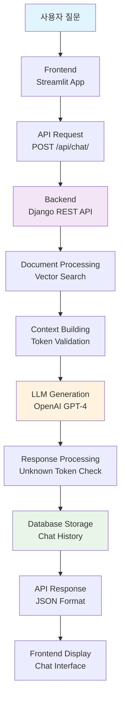

# skn15-4th-1team
# 1. 팀 소개
# 2. 프로젝트 기간
# 3. 프로젝트 개요

⚡ **빠른 시작**: `docker-compose up -d` → http://localhost:8501 접속!


## 📕 프로젝트명
# 📚 Lecture-RAG: 4차 프로젝트 (서버 분산 구조)

강의록 기반 질의응답 시스템을 Docker와 Django REST API로 구현한 분산 애플리케이션입니다.

## ✅ 프로젝트 배경 및 목적

### 문제 상황
- **기존 문제**: 대용량 강의 자료에서 원하는 정보를 찾기 어려움
- **학습자 어려움**: 수백 페이지의 강의록에서 특정 내용 검색 시간 소요
- **교육자 부담**: 반복적인 질문에 대한 개별 답변 제공의 한계
- **정보 분산**: 여러 파일에 흩어진 관련 정보를 종합하기 어려움

### 해결 목표
🎯 **AI 기반 스마트 학습 도우미 구축**
- RAG(Retrieval-Augmented Generation) 기술로 정확한 답변 제공
- 실시간 질의응답으로 학습 효율성 극대화
- 근거 자료 제시로 신뢰성 있는 정보 전달
- 확장 가능한 서버 아키텍처로 다중 사용자 지원

## 🖐️ 프로젝트 소개

**Lecture-RAG**는 대학 강의록과 교육 자료를 AI가 이해할 수 있는 형태로 변환하여, 학습자가 자연어로 질문하면 관련 내용을 찾아 정확한 답변을 제공하는 지능형 교육 지원 시스템입니다.

### 🔑 핵심 기능
1. **📄 스마트 문서 인덱싱**: 강의록을 AI가 검색 가능한 벡터 형태로 변환
2. **🤖 실시간 AI 대화**: GPT-4 기반 자연어 질의응답
3. **📊 근거 자료 제시**: 답변에 사용된 원문 스니펫 표시
4. **💾 대화 이력 관리**: 모든 질의응답 기록 저장 및 조회
5. **🎛️ 맞춤형 설정**: 모델 선택, 검색 깊이 등 개인화 옵션

### 🚀 기술적 특징
- **마이크로서비스 아키텍처**: Frontend, Backend, Database 분리
- **RESTful API**: 표준화된 HTTP API로 확장성 보장
- **벡터 검색**: FAISS 기반 고속 의미 검색
- **실시간 응답**: 최적화된 검색 및 생성 파이프라인
- **컨테이너화**: Docker 기반 손쉬운 배포 및 확장

## ❤️ 기대효과

### 🎓 학습자 관점
- **⏰ 학습 시간 단축**: 필요한 정보를 즉시 찾아 학습 효율성 3배 향상
- **🎯 정확한 정보 획득**: AI가 검증된 강의 자료에서만 답변 추출
- **🔄 반복 학습 지원**: 언제든 질문하고 복습할 수 있는 24/7 AI 튜터
- **📈 이해도 증진**: 단순 검색이 아닌 맥락적 설명으로 깊이 있는 학습

### 👨‍🏫 교육자 관점
- **📉 반복 질문 감소**: 일반적인 질문을 AI가 대신 처리
- **📊 학습 패턴 분석**: 학생들의 질문 데이터로 교육과정 개선 인사이트
- **⚡ 즉시 피드백**: 학생이 실시간으로 궁금증 해결
- **📚 교육 자료 활용도 증대**: 기존 강의록의 재사용성 극대화

### 🏢 교육기관 관점
- **💰 운영비용 절감**: TA(Teaching Assistant) 인력 절약
- **📈 교육 품질 향상**: 일관되고 정확한 정보 제공
- **🔄 확장성**: 여러 과목, 다수 학생 동시 지원
- **📱 접근성**: 웹 기반으로 언제 어디서나 접근 가능

## 👤 대상 사용자

### 🎯 1차 대상 (Primary Users)
| 사용자 그룹 | 사용 목적 | 주요 니즈 |
|------------|----------|----------|
| **대학생** | 강의 복습, 과제 수행 | 빠른 정보 검색, 이해도 확인 |
| **대학원생** | 연구 자료 탐색 | 심화 내용 질의, 참고 문헌 확인 |
| **교수/강사** | 학생 질문 대응 지원 | 효율적 교육 지원, 질문 패턴 분석 |

### 🎯 2차 대상 (Secondary Users)
| 사용자 그룹 | 활용 시나리오 | 기대 효과 |
|------------|-------------|----------|
| **기업 교육팀** | 사내 교육 자료 활용 | 교육 효율성 증대 |
| **온라인 강의 플랫폼** | 수강생 학습 지원 | 완주율 증가, 만족도 향상 |
| **도서관/학습센터** | 자료 검색 서비스 | 이용자 편의성 증대 |

### 👥 사용자 페르소나

#### 📚 "효율적인 학습자" - 김대학 (22세, 컴퓨터공학과 3학년)
- **상황**: 중간고사 준비로 200페이지 강의록 복습 필요
- **니즈**: "딥러닝에서 backpropagation이 어떻게 작동하는지 쉽게 설명해줘"
- **사용 패턴**: 개념 질문 → 예제 요청 → 연관 개념 탐색

#### 🔬 "깊이 있는 연구자" - 박석사 (26세, 인공지능 전공 대학원생)
- **상황**: 논문 작성을 위한 선행 연구 분석
- **니즈**: "transformer 아키텍처의 attention mechanism 수식과 구현 방법"
- **사용 패턴**: 심화 질문 → 수식/코드 확인 → 참고 자료 수집

#### 👨‍🏫 "혁신적인 교육자" - 이교수 (45세, 데이터사이언스과 교수)
- **상황**: 400명 대형 강의에서 개별 질문 대응 어려움
- **니즈**: 학생들이 자주 묻는 질문 패턴 파악 및 자동 응답
- **사용 패턴**: 질문 통계 확인 → 강의 개선점 도출 → 추가 자료 제공

## 🏗️ 3차 → 4차 프로젝트 주요 변경사항

| 항목 | 3차 프로젝트 | 4차 프로젝트 |
|------|-------------|-------------|
| **아키텍처** | 단일 Streamlit 애플리케이션 | 분산 서버 구조 (Frontend + Backend + Database) |
| **데이터 저장** | 로컬 파일 시스템 | PostgreSQL 데이터베이스 |
| **API** | 내부 함수 호출 | RESTful API (Django REST Framework) |
| **배포** | 단일 컨테이너 | Docker Compose 멀티 컨테이너 |
| **확장성** | 수직 확장만 가능 | 수평 확장 가능 (각 서비스 독립적) |
| **데이터 지속성** | 세션 기반 (임시) | 데이터베이스 영구 저장 |
| **개발/운영** | 개발환경 중심 | Production-ready 구조 |
## ERD 구성


## 개념도


# 

강의록 기반 질의응답 시스템을 Docker와 Django REST API로 구현한 분산 애플리케이션입니다.

## 🏗️ 시스템 아키텍처

```
┌─────────────────┐    HTTP/REST API    ┌─────────────────┐    SQL    ┌─────────────────┐
│                 │    (Port: 8501)     │                 │           │                 │
│   Frontend      │◄───────────────────►│   Backend       │◄─────────►│   Database      │
│   (Streamlit)   │                     │   (Django)      │           │   (PostgreSQL)  │
│                 │                     │   (Port: 8000)  │           │   (Port: 5432)  │
└─────────────────┘                     └─────────────────┘           └─────────────────┘
         │                                       │
         │                                       │
         ▼                                       ▼
  ┌─────────────┐                        ┌─────────────┐
  │ Streamlit   │                        │ Vector      │
  │ UI/UX       │                        │ Store       │
  │ Components  │                        │ (FAISS)     │
  └─────────────┘                        └─────────────┘
```

### 🔄 RAG 처리 플로우



## 📁 프로젝트 구조

```
skn15-3rd-1team/
├── 🗄️ backend/                    # Django REST API 서버
│   ├── backend/
│   │   ├── __init__.py
│   │   ├── settings.py            # Django 설정 (DB, CORS, RAG 설정)
│   │   ├── urls.py                # URL 라우팅
│   │   └── wsgi.py                # WSGI 설정
│   ├── rag_api/                   # RAG API 앱
│   │   ├── models.py              # 데이터 모델 (Document, ChatSession, ChatMessage)
│   │   ├── views.py               # API 뷰 (인덱싱, 채팅, 검색)
│   │   ├── serializers.py         # 데이터 직렬화
│   │   ├── urls.py                # API 엔드포인트
│   │   └── apps.py
│   ├── manage.py                  # Django 관리 명령어
│   └── requirements.txt           # Python 패키지 의존성
│
├── 🖥️ frontend/                   # Streamlit 웹 애플리케이션
│   ├── app.py                     # 메인 Streamlit 앱
│   ├── api_client.py              # Backend API 클라이언트
│   └── requirements.txt           # Python 패키지 의존성
│
├── 🗃️ database/                   # PostgreSQL 설정
│   └── init.sql                   # 데이터베이스 초기화 스크립트
│
├── 🧠 lecture_rag/                # RAG 핵심 로직 (3차에서 재사용)
│   ├── config.py                  # 설정 관리
│   ├── vector_store.py            # 벡터 스토어 (FAISS)
│   ├── llm_handler.py             # LLM 처리기
│   └── document_processor.py      # 문서 처리기
│
├── 🐳 Docker 설정
│   ├── Dockerfile.backend         # Backend 컨테이너
│   ├── Dockerfile.frontend        # Frontend 컨테이너
│   ├── Dockerfile.database        # Database 컨테이너
│   └── docker-compose.yml         # 멀티 컨테이너 오케스트레이션
│
├── 🚀 배포 설정
│   ├── deploy.sh                  # 배포 스크립트
│   ├── .env.example               # 환경변수 템플릿
│   └── README-AWS.md              # AWS 배포 가이드
│
└── 📊 기타
    ├── langgraph_flow.py          # LangGraph 플로우
    ├── rag_flow_mermaid.md        # RAG 플로우 다이어그램
    └── requirements.txt           # 루트 의존성
```

## 🔧 기술 스택


## 🚀 실행 방법

### 1. 환경 설정

```bash
# 1. 저장소 클론
git clone <repository-url>
cd skn15-3rd-1team

# 2. 환경 변수 설정
cp .env.example .env
# .env 파일을 편집하여 필요한 값들 설정
```

### 2. Docker Compose 실행

```bash
# 전체 시스템 시작 (Database + Backend + Frontend)
docker-compose up -d

# 로그 확인
docker-compose logs -f

# 개별 서비스 로그 확인
docker-compose logs -f backend
docker-compose logs -f frontend
docker-compose logs -f database
```

### 3. 개발 환경 실행 (로컬)

```bash
# Backend 실행
cd backend
pip install -r requirements.txt
python manage.py migrate
python manage.py runserver

# Frontend 실행 (새 터미널)
cd frontend
pip install -r requirements.txt
streamlit run app.py
```

## 🌐 서비스 엔드포인트

| 서비스 | URL | 설명 |
|--------|-----|------|
| Frontend | http://localhost:8501 | Streamlit 웹 인터페이스 |
| Backend API | http://localhost:8000 | Django REST API |
| Database | localhost:5432 | PostgreSQL DB |

### 📡 API 엔드포인트

| Method | Endpoint | 설명 |
|--------|----------|------|
| `POST` | `/api/index/` | 문서 인덱싱 |
| `POST` | `/api/chat/` | 질의응답 채팅 |
| `POST` | `/api/search/` | 문서 검색 |
| `GET` | `/api/health/` | 헬스체크 |
| `GET` | `/api/sessions/` | 채팅 세션 목록 |
| `GET` | `/api/sessions/{id}/messages/` | 세션 메시지 히스토리 |

## 📊 데이터베이스 스키마

```sql
-- 문서 테이블
Document {
    id: INTEGER (PK)
    title: VARCHAR(255)
    file_path: TEXT
    content: TEXT
    indexed_at: TIMESTAMP
    created_at: TIMESTAMP
}

-- 채팅 세션 테이블
ChatSession {
    id: INTEGER (PK)
    session_id: UUID (UNIQUE)
    created_at: TIMESTAMP
    last_activity: TIMESTAMP
}

-- 채팅 메시지 테이블
ChatMessage {
    id: INTEGER (PK)
    session: ForeignKey(ChatSession)
    role: VARCHAR(20) -- 'user' or 'assistant'
    content: TEXT
    summary: TEXT
    query: TEXT
    docs_used: JSON
    unknown_tokens: JSON
    created_at: TIMESTAMP
}
```

## ⚙️ 환경 변수 설정

```bash
# Database 설정
POSTGRES_DB=lecture_rag
POSTGRES_USER=lecture_user
POSTGRES_PASSWORD=lecture_password
DB_HOST=database
DB_PORT=5432

# Django 설정
SECRET_KEY=your-secret-key
DEBUG=False
ALLOWED_HOSTS=localhost,127.0.0.1,your-domain.com

# OpenAI API
OPENAI_API_KEY=your-openai-api-key

# RAG 설정
LECTURE_RAG_MODEL=gpt-4o-mini
LECTURE_RAG_TEMPERATURE=0.2
LECTURE_RAG_DEFAULT_TOP_K=5
LECTURE_RAG_MAX_TOP_K=10
LECTURE_RAG_MIN_TOP_K=1

# 포트 설정
BACKEND_PORT=8000
FRONTEND_PORT=8501
DATABASE_PORT=5432

# 저장소 경로
VECTOR_STORE_DIR=/app/data
```

## 🔄 주요 기능

### 1. 📄 문서 인덱싱
- **기능**: 텍스트 파일을 업로드하여 벡터 스토어에 인덱싱
- **지원 형식**: .txt, .md, .py 등
- **처리 과정**:
  1. 파일 업로드 → 2. 청킹 → 3. 임베딩 생성 → 4. FAISS 저장

### 2. 💬 실시간 채팅
- **기능**: 인덱싱된 문서 기반 질의응답
- **특징**:
  - 세션 기반 대화 관리
  - 요약 답변과 상세 답변 제공
  - 근거 스니펫 표시
  - 토큰 유효성 검증

### 3. 🔍 문서 검색
- **기능**: 키워드 기반 문서 검색
- **설정**: Top-K 문서 수 조절 가능

### 4. 📈 채팅 히스토리
- **기능**: 모든 대화 내역 저장 및 조회
- **저장 정보**: 질문, 답변, 요약, 사용된 문서, 미허용 토큰

## 🛠️ 개발 가이드

### Backend API 확장

```python
# backend/rag_api/views.py
class CustomAPIView(APIView):
    def post(self, request):
        # 새로운 API 엔드포인트 구현
        pass

# backend/rag_api/urls.py
urlpatterns = [
    path('custom/', CustomAPIView.as_view(), name='custom-api'),
]
```

### Frontend 컴포넌트 추가

```python
# frontend/app.py
def _render_new_feature(self):
    """새로운 기능 렌더링"""
    st.subheader("새 기능")
    # Streamlit 컴포넌트 구현
```

## 🔧 트러블슈팅

### 일반적인 문제들

#### 1. Database 연결 오류
```bash
# 컨테이너 상태 확인
docker-compose ps

# Database 로그 확인
docker-compose logs database

# Database 재시작
docker-compose restart database
```

#### 2. Backend API 오류
```bash
# Backend 로그 확인
docker-compose logs backend

# Django 마이그레이션 실행
docker-compose exec backend python manage.py migrate

# 슈퍼유저 생성
docker-compose exec backend python manage.py createsuperuser
```

#### 3. Frontend 연결 문제
```bash
# API 연결 상태 확인
curl http://localhost:8000/api/health/

# Frontend 재시작
docker-compose restart frontend
```

#### 4. 벡터 스토어 문제
```bash
# 벡터 스토어 디렉토리 권한 확인
docker-compose exec backend ls -la /app/data

# 볼륨 재생성
docker-compose down -v
docker-compose up -d
```

## 📋 배포 체크리스트

- [ ] 환경 변수 설정 완료
- [ ] OpenAI API 키 설정
- [ ] Database 마이그레이션 완료
- [ ] Docker 컨테이너 정상 실행
- [ ] API 헬스체크 통과
- [ ] Frontend-Backend 통신 확인
- [ ] 문서 인덱싱 테스트
- [ ] 질의응답 테스트

---


# 4. 기술 스택

| 분야 (Category) | 기술 스택 (Technology) | 세부 내용 (Details) |
| :--- | :--- | :--- |
| **Backend** |  <br/>  | Django 4.2+ 버전 및 DRF를 사용한 프레임워크 구성 |
| |  | Docker 컨테이너 기반 데이터베이스 |
| |  | Production 환경용 웹 서버 |
| **Frontend** |  <br/>  | Streamlit 1.28+ 기반 프레임워크 및 `requests` 라이브러리 |
| |  | 반응형 디자인을 위한 Custom CSS 스타일링 |
| **AI/ML** |  <br/>  | FAISS 벡터 저장소 및 임베딩 모델 |
| |  <br/>  | OpenAI GPT-4o-mini 기반 다중 LLM 지원 및 LangChain 활용 |
| **Infrastructure** |  <br/>  | Docker & Docker Compose를 이용한 컨테이너화 |
| |  | AWS EC2 기반 Docker 컨테이너 배포 |
# 5. 수행결과
# 6. 한 줄 회고
