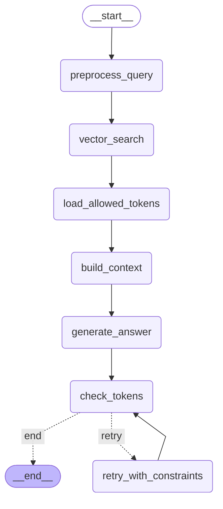

# RAG Flow Diagram

```mermaid
---
config:
  flowchart:
    curve: linear
---
graph TD;
	__start__([<p>__start__</p>]):::first
	preprocess_query(preprocess_query)
	vector_search(vector_search)
	load_allowed_tokens(load_allowed_tokens)
	build_context(build_context)
	generate_answer(generate_answer)
	check_tokens(check_tokens)
	retry_with_constraints(retry_with_constraints)
	__end__([<p>__end__</p>]):::last
	__start__ --> preprocess_query;
	build_context --> generate_answer;
	check_tokens -. &nbsp;end&nbsp; .-> __end__;
	check_tokens -. &nbsp;retry&nbsp; .-> retry_with_constraints;
	generate_answer --> check_tokens;
	load_allowed_tokens --> build_context;
	preprocess_query --> vector_search;
	retry_with_constraints --> check_tokens;
	vector_search --> load_allowed_tokens;
	classDef default fill:#f2f0ff,line-height:1.2
	classDef first fill-opacity:0
	classDef last fill:#bfb6fc

```